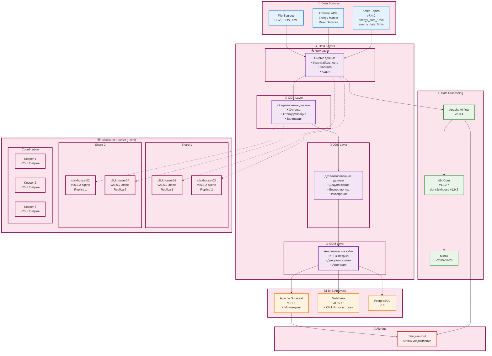
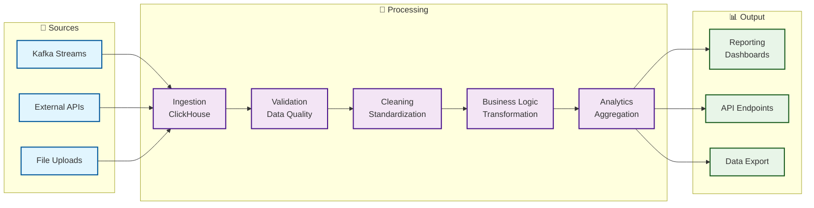

# 🚀 ClickHouse EnergyHub

**Современная платформа Data Warehouse для энергетической отрасли**

[](https://opensource.org/licenses/MIT)
[](https://www.python.org/downloads/)
[](https://clickhouse.com/)
[](https://www.getdbt.com/)
[](https://airflow.apache.org/)

## 🎯 О проекте

ClickHouse EnergyHub - это полнофункциональная платформа для сбора, обработки и анализа данных в энергетической отрасли. Система построена на современных технологиях и обеспечивает высокую производительность, масштабируемость и надежность.

### ✨ Ключевые возможности

- 🗄️ **ClickHouse кластер** с 4 узлами для аналитики в реальном времени
- 🔄 **Apache Airflow** для оркестрации данных и автоматизации процессов
- 🧹 **dbt** для трансформации данных и обеспечения качества
- 📊 **Автоматическая дедупликация** данных каждые 5 минут
- 🔍 **Динамическое обновление** dbt источников на основе ClickHouse
- 📈 **Superset & Metabase** для визуализации и самообслуживания (настройка подключений - вручную)
- 🚀 **CI/CD пайплайн** для автоматизации развертывания
- 📋 **Terraform** для управления инфраструктурой как код

## 🏗️ Архитектура

Система построена по принципам современной архитектуры Data Warehouse:



### 🔄 Поток данных



## 🚀 Быстрый старт

**Развертывание за 15 минут!**

```bash
# 1. Клонирование репозитория
git clone https://github.com/principalwater/clickhouse-energyhub.git
cd clickhouse-energyhub/infra/terraform

# 2. Создание файла с переменными (копируем заполненный dummy-пример)
cp terraform.tfvars.example terraform.tfvars

# 3. Запуск развертывания
cd ../../
./deploy.sh
```

**📖 Подробный туториал:** [QUICK_START.md](QUICK_START.md)

## 📚 Документация

### 🏗️ Основная документация

- **[🏗️ Архитектура DWH](docs/ARCHITECTURE.md)** - Подробное описание архитектуры, слоев данных и нейминг конвенций
- **[🔗 Интеграция dbt с ClickHouse](docs/DBT_INTEGRATION.md)** - Полное руководство по работе с dbt моделями, тестами и макросами
- **[🚀 CI/CD Pipeline](docs/CI_CD.md)** - Автоматизация разработки, тестирования и развертывания

### 🔧 Специализированная документация

- **[🔄 DAG Deduplication Pipeline](docs/README_deduplication.md)** - Автоматическая очистка дублей и обновление источников
- **[💾 ClickHouse Backup Pipeline](docs/README_clickhouse_backup.md)** - Система резервного копирования и восстановления
- **[🚀 Руководство по развертыванию](docs/DEPLOYMENT.md)** - Подробное руководство по развертыванию системы
- **[☁️ Настройка Apache Airflow](docs/AIRFLOW_SETUP.md)** - Конфигурация и настройка Airflow
- **[💾 Руководство по резервному копированию](docs/BACKUP_GUIDE.md)** - Система бэкапов и восстановления
- **[📊 Создание таблиц из Kafka](docs/KAFKA_TO_CH_TABLE_CREATE_README.md)** - DAG для динамического создания таблиц

### 📁 Структура проекта

```
clickhouse-energyhub/
├── README.md                                    # Основной файл проекта
├── QUICK_START.md                               # Быстрый старт и развертывание
├── 📚 docs/                                     # Документация проекта
│   ├── ARCHITECTURE.md                          # Архитектура DWH
│   ├── DBT_INTEGRATION.md                       # Интеграция dbt
│   ├── CI_CD.md                                 # CI/CD пайплайн
│   ├── DEPLOYMENT.md                            # Руководство по развертыванию
│   ├── AIRFLOW_SETUP.md                         # Настройка Apache Airflow
│   ├── BACKUP_GUIDE.md                          # Руководство по резервному копированию
│   ├── KAFKA_TO_CH_TABLE_CREATE_README.md      # Создание таблиц из Kafka
│   ├── README_deduplication.md                  # DAG дедупликации
│   └── README_clickhouse_backup.md              # DAG бэкапов
├── 🏗️ infra/                                    # Инфраструктура
│   ├── terraform/                               # Terraform конфигурация
│   │   └── cleanup_airflow.sh                   # Скрипт очистки Airflow при зависании
│   └── docker/                                  # Docker конфигурация
├── 🔄 airflow/                                  # Apache Airflow
│   └── dags/                                    # DAG'и для оркестрации
├── 🧹 dbt/                                      # dbt проекты
│   ├── models/                                  # Модели данных
│   ├── tests/                                   # Тесты
│   └── tools/                                   # Утилиты
├── 📜 scripts/                                  # Скрипты автоматизации
├── 🧪 tests/                                    # Тесты проекта
└── 📋 deploy.sh                                 # Скрипт развертывания
```

## 🌟 Основные компоненты

### 🗄️ ClickHouse Cluster

- **4 узла** с репликацией и шардированием
- **Высокая производительность** для аналитических запросов
- **Автоматическое масштабирование** и балансировка нагрузки
- **Встроенная система** резервного копирования

### 🔄 Apache Airflow

- **Оркестрация** всех процессов обработки данных
- **Планировщик задач** с настраиваемым расписанием
- **Мониторинг** выполнения и уведомления об ошибках
- **Интеграция** с ClickHouse и dbt
- **Telegram алертинг** для мониторинга DAG'ов и системы
- **Автоматическая настройка** Telegram соединения при деплое
- **Автоматическая настройка** ClickHouse соединений в Metabase и Superset
- **Автоматическое восстановление** при зависании через скрипт очистки

### 🧹 dbt (data build tool)

- **Трансформация данных** через SQL с поддержкой ClickHouse
- **Автоматическое тестирование** качества данных (DQ проверки)
- **Документация** моделей и источников
- **Версионирование** схемы данных
- **Архитектурные слои**: Raw → ODS → DDS → CDM
- **Макросы** для оптимизации ClickHouse (ReplicatedMergeTree, Distributed)

### 📊 Визуализация

- **Apache Superset** - аналитические дашборды и мониторинг
- **Metabase** - самообслуживание аналитики
- **Airflow алертинг** - уведомления в Telegram

## 🔄 Автоматизация

### 🧹 Система дедупликации

**DAG `deduplication_pipeline`** автоматически:

- 🔄 **Обновляет dbt sources** на основе таблиц в ClickHouse
- 🧹 **Удаляет дубли** из `raw.river_flow` и `ods.market_data`
- 📊 **Создает очищенные таблицы** в слое DDS
- ✅ **Запускает тесты** для проверки качества данных
- 📈 **Генерирует отчеты** по результатам обработки

**Расписание:** Каждые 5 минут

### 💾 Система резервного копирования

**DAG `clickhouse_backup_pipeline`** обеспечивает:

- 💾 **Создание бэкапов** ClickHouse
- 📋 **Верификацию** целостности бэкапов
- 🔄 **Восстановление** данных при необходимости
- 🧹 **Очистку** старых бэкапов
- 📊 **Мониторинг** здоровья системы

## 🚀 CI/CD Pipeline

### 🔄 Автоматизация разработки

- **GitHub Actions** для непрерывной интеграции
- **Автоматическое тестирование** кода и инфраструктуры
- **Сканирование безопасности** и зависимостей
- **Автоматическое развертывание** через Terraform

### 🧪 Качество кода

- **Linting** с flake8, black, isort
- **Unit тесты** с pytest
- **Интеграционные тесты** для всех компонентов
- **Coverage отчеты** и quality gates

## 📊 Мониторинг и метрики

### 🔍 Ключевые метрики

- **Data Freshness** - актуальность данных
- **Data Quality** - качество данных
- **Processing Time** - время обработки
- **Error Rate** - частота ошибок
- **Storage Usage** - использование хранилища

### 🚨 Алерты и мониторинг

- **Telegram алертинг** - уведомления через Airflow DAG'и
- **Мониторинговые дашборды** - в Apache Superset
- **Pipeline Failures** - сбои в пайплайнах
- **Data Quality Issues** - проблемы с качеством
- **Performance Degradation** - деградация производительности
- **Storage Thresholds** - превышение лимитов

## 🛠️ Технологический стек

### 🗄️ База данных
- **ClickHouse** - аналитическая СУБД
- **PostgreSQL** - метаданные и конфигурация
- **Redis** - кэширование и очереди

### 🔄 Оркестрация
- **Apache Airflow** - планировщик задач
- **dbt** - трансформация данных
- **Kafka** - потоковая обработка

### 🏗️ Инфраструктура
- **Docker** - контейнеризация
- **Terraform** - инфраструктура как код
- **Portainer** - управление контейнерами

### 🧪 Тестирование и качество
- **pytest** - фреймворк тестирования
- **flake8, black, isort** - линтеры и форматтеры
- **CodeQL** - анализ безопасности
- **Trivy** - сканирование контейнеров

## 🔮 Планы развития

### 🎯 Краткосрочные (3-6 месяцев)
- [ ] Реализация Data Lineage
- [ ] Автоматизация тестирования данных
- [ ] Настройка Telegram алертинга через Airflow DAG'и
- [ ] Создание мониторинговых дашбордов в Superset
- [ ] Machine Learning модели

### 🚀 Среднесрочные (6-12 месяцев)
- [ ] Real-time Analytics
- [ ] Расширенные интеграции
- [ ] Multi-cloud архитектура
- [ ] Advanced Analytics Platform

### 🌟 Долгосрочные (1+ год)
- [ ] AI-powered Insights
- [ ] Automated Data Governance
- [ ] Edge Computing интеграция
- [ ] Quantum Computing готовность

## 🤝 Участие в проекте

### 📝 Как внести вклад

1. **Fork** репозитория
2. **Создайте** feature branch (`git checkout -b feature/amazing-feature`)
3. **Зафиксируйте** изменения (`git commit -m 'Add amazing feature'`)
4. **Push** в branch (`git push origin feature/amazing-feature`)
5. **Откройте** Pull Request

### 🐛 Сообщение об ошибках

- Используйте [GitHub Issues](https://github.com/principalwater/clickhouse-energyhub/issues)
- Опишите проблему подробно
- Приложите логи и скриншоты
- Укажите версии компонентов

### 💡 Предложения

- Создайте [GitHub Discussion](https://github.com/principalwater/clickhouse-energyhub/discussions)
- Опишите идею и обоснование
- Обсудите с сообществом
- Создайте прототип при необходимости

## 📄 Лицензия

Этот проект распространяется под лицензией MIT. См. файл [LICENSE](LICENSE) для подробностей.

## 🙏 Благодарности

- **ClickHouse Team** за отличную аналитическую СУБД
- **Apache Airflow** за мощную оркестрацию данных
- **dbt Labs** за инструмент трансформации данных
- **Сообщество** за вклад и поддержку

## 📞 Поддержка

### 🔗 Полезные ссылки

- **Документация:** [docs/](docs/)
- **📊 Настройка BI-инструментов:** [docs/BI_CLICKHOUSE_SETUP.md](docs/BI_CLICKHOUSE_SETUP.md)
- **Issues:** [GitHub Issues](https://github.com/principalwater/clickhouse-energyhub/issues)
- **Discussions:** [GitHub Discussions](https://github.com/principalwater/clickhouse-energyhub/discussions)
- **Wiki:** [GitHub Wiki](https://github.com/principalwater/clickhouse-energyhub/wiki)

### 📧 Контакты

- **Developer:** [principalwater](https://github.com/principalwater)

---

**⭐ Если проект вам понравился, поставьте звездочку!**
