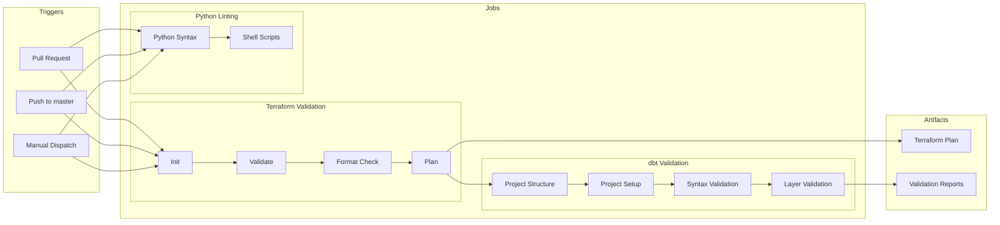

# ClickHouse EnergyHub

Комплексное решение для мониторинга и анализа энергопотребления с использованием ClickHouse, dbt и современных технологий обработки данных.

## 🚀 Возможности

- **Мониторинг энергопотребления** в реальном времени
- **Data Quality проверки** с автоматическими алертами
- **Многослойная архитектура данных** (RAW → ODS → DDS → CDM)
- **Оптимизация для ClickHouse** с индексами и партиционированием
- **Инкрементальная загрузка** данных
- **Готовые аналитические запросы** для BI систем

## 🏗️ Архитектура

```
┌─────────────────┐    ┌─────────────────┐    ┌─────────────────┐    ┌─────────────────┐
│      RAW        │    │      ODS        │    │      DDS        │    │      CDM        │
│                 │    │                 │    │                 │    │                 │
│ • Kafka data    │───▶│ • Preprocessing │───▶│ • Business      │───▶│ • Aggregated    │
│ • As-is format  │    │ • DQ checks     │    │   logic         │    │ • BI ready      │
│ • No changes    │    │ • Data cleaning │    │ • Detailed      │    │ • KPIs          │
│ • View          │    │ • View          │    │ • Table         │    │ • Table         │
└─────────────────┘    └─────────────────┘    └─────────────────┘    └─────────────────┘
                                    │
                                    ▼
                    ┌─────────────────────────────────────┐
                    │      ClickHouse Cluster dwh_prod    │
                    │                                     │
                    │  ┌─────────────┐  ┌─────────────┐   │
                    │  │   Shard 1   │  │   Shard 2   │   │
                    │  │ Replica 1,2 │  │ Replica 1,2 │   │
                    │  └─────────────┘  └─────────────┘   │
                    │                                     │
                    │  ┌─────────────────────────────┐    │
                    │  │     3x ClickHouse Keeper    │    │
                    │  └─────────────────────────────┘    │
                    └─────────────────────────────────────┘
```

### Слои данных

1. **RAW** - Сырые данные из Kafka
2. **ODS** - Предобработка с DQ проверками
3. **DDS** - Детальный слой с бизнес-логикой
4. **CDM** - Готовые для BI агрегаты (Consolidated Data Marts)

## 🛠️ Технологии

- **ClickHouse** - Высопроизводительная СУБД для аналитики
  - **Кластер dwh_prod**: 4 ноды (2 шарда × 2 реплики)
  - **ReplicatedMergeTree** + **Distributed** таблицы
  - **3 ноды ClickHouse Keeper** для координации
- **dbt** - Инструмент для трансформации данных
  - **dbt-core 1.10.7** + **dbt-clickhouse 1.9.2**
  - **Многослойная архитектура**: RAW → ODS → DDS → CDM
  - **Поддержка всех материализаций**: view, table, incremental, ephemeral
  - **ClickHouse-специфичные макросы** для оптимизации
  - **Теги для CI/CD**: `tag:raw`, `tag:ods`, `tag:dds`, `tag:cdm`
- **Kafka** - Потоковая обработка данных
- **Terraform** - Инфраструктура как код
- **Docker** - Контейнеризация

## 📁 Структура проекта

```
clickhouse-energyhub/
├── dbt/                    # Модуль dbt для трансформации данных
│   ├── models/            # Модели данных по слоям (RAW, ODS, DDS, CDM)
│   ├── macros/            # Макросы для DQ и ClickHouse
│   ├── tests/             # Тесты качества данных
│   ├── profiles/          # Конфигурация подключений
│   └── tools/             # Скрипты управления dbt
├── infra/                 # Terraform инфраструктура
├── monitoring/            # Системы мониторинга
├── scripts/               # Скрипты автоматизации
├── .github/workflows/     # CI/CD конфигурация GitHub Actions
│   ├── ci.yml            # Основной pipeline
│   ├── approve.yml       # Авто-аппрув PR
│   └── dbt-ci-setup.sh   # Настройка dbt для CI
└── volumes/               # Docker volumes
```

## 🚀 Быстрый старт

### Предварительные требования

- Docker и Docker Compose
- Python 3.9+
- Terraform 1.0+
- dbt-core >= 1.10.0

### Установка

1. **Клонирование репозитория**
```bash
git clone https://github.com/principalwater/clickhouse-energyhub.git
cd clickhouse-energyhub
```

2. **Запуск инфраструктуры**
```bash
cd infra
terraform init
terraform plan
terraform apply
```

3. **Настройка dbt**
```bash
cd dbt
pip install -r requirements.txt
cp profiles/profiles.yml ~/.dbt/
# Настройте параметры подключения в ~/.dbt/profiles.yml
```

4. **Запуск dbt**
```bash
./run_dbt.sh run dev
./run_dbt.sh test dev
./run_dbt.sh docs --serve
```

## 🔄 dbt - Трансформация данных

### Архитектура dbt

```
┌─────────────┐    ┌──────────────┐    ┌─────────────┐
│   Staging   │───▶│ Intermediate │───▶│    Marts    │
│             │    │              │    │             │
│ • Очистка   │    │ • Агрегация  │    │ • KPI       │
│ • Валидация │    │ • Почасовые  │    │ • Бизнес-   │
│ • Нормализ. │    │ • Ежедневные │    │   логика    │
└─────────────┘    └──────────────┘    └─────────────┘
```

### Слои данных

1. **Staging** - Очистка и валидация сырых данных
   - Проверка качества данных (DQ)
   - Нормализация форматов
   - Базовые вычисления

2. **Intermediate** - Промежуточные агрегации
   - Почасовые агрегаты
   - Ежедневные агрегаты
   - Региональные агрегаты

3. **Marts** - Готовые для BI таблицы
   - KPI и метрики
   - Бизнес-логика
   - Оптимизированные запросы

### Материализации

- **View** - Виртуальные таблицы (по умолчанию)
- **Table** - Физические таблицы для производительности
- **Incremental** - Инкрементальные обновления
- **Ephemeral** - Временные CTE для зависимостей

### ClickHouse оптимизации

- **Партиционирование** по месяцам/дням
- **MergeTree** движки для таблиц
- **Специальные макросы** для ClickHouse
- **Поддержка кластерных таблиц**

### Команды dbt

```bash
# Активация окружения
source dbt_env/bin/activate

# Запуск моделей
dbt run                    # Все модели
dbt run --select marts     # Только marts
dbt run --select +fact_energy_daily  # С зависимостями

# Тестирование
dbt test                   # Все тесты
dbt test --select test_type:completeness  # Конкретный тип

# Документация
dbt docs generate          # Генерация
dbt docs serve             # Веб-интерфейс

# Снапшоты
dbt snapshot               # Создание снапшотов

# Seeds
dbt seed                   # Загрузка CSV данных
```

### Мониторинг и отладка

```bash
# Компиляция без выполнения
dbt compile

# Проверка зависимостей
dbt list

# Подробные логи
dbt run --verbose

# Проверка конкретной модели
dbt run --select model_name --full-refresh
```

## 📊 Data Quality

### DQ Score

Каждая модель имеет DQ score (0-1), рассчитываемый на основе:
- **Полнота критических полей** (40%)
- **Валидность бизнес-правил** (40%)
- **Формат данных** (20%)

### Пороги качества

- **RAW → ODS**: DQ score ≥ 0.7
- **ODS → DDS**: DQ score ≥ 0.8
- **DDS → CDM**: DQ score ≥ 0.9

### DQ проверки

- Полнота данных
- Диапазон значений
- Бизнес-правила
- Согласованность данных
- Временная последовательность

## 🔧 Оптимизация ClickHouse

### Кластерная архитектура

- **Кластер dwh_prod** - 2 шарда × 2 реплики
- **ReplicatedMergeTree** - основная таблица с автоматической репликацией
- **Distributed** - виртуальная таблица для распределенных операций
- **ON CLUSTER** - все операции выполняются на всех нодах кластера

### Индексы

- **MinMax** - Для временных полей и ID
- **Set** - Для категориальных полей
- **Bloom Filter** - Для текстовых полей

### Партиционирование

- **По дате** - Ежемесячное партиционирование
- **По региону** - Географическое партиционирование
- **По шарду** - cityHash64 для равномерного распределения

### Движки таблиц

- **ReplicatedMergeTree** - Основной движок для кластера
- **Distributed** - Для распределенных запросов
- **ReplacingMergeTree** - Для обновляемых данных
- **AggregatingMergeTree** - Для агрегированных данных

## 📈 Аналитика

### Готовые метрики

- Энергопотребление по регионам
- Эффективность устройств
- Сезонность потребления
- Анализ аномалий
- Тренды энергопотребления

### Примеры запросов

См. файл `dbt/examples/example_queries.sql` для готовых SQL запросов.

### ⚠️ Примечание о ML функционале

**ML функционал (*) представлен не будет и приведен теоретически в рамках демонстрации потенциального решения.** В архитектуре DWH ML компоненты отмечены звездочкой и показаны пунктирными линиями.

## 🚀 Использование dbt

### Основные команды

```bash
# Запуск моделей
./run_dbt.sh run dev                    # Все модели в dev
./run_dbt.sh run prod tag:ods          # ODS модели в prod
./run_dbt.sh run dev stg_locations     # Конкретная модель

# Запуск тестов
./run_dbt.sh test dev                  # Все тесты в dev
./run_dbt.sh test dev stg_locations    # Тест конкретной модели

# DQ проверки
./run_dbt.sh dq dev                    # DQ проверки в dev

# Документация
./run_dbt.sh docs --serve              # Генерация и запуск документации
```

### Слои и теги

```bash
# Запуск по слоям
dbt run --select tag:raw               # RAW слой
dbt run --select tag:ods               # ODS слой
dbt run --select tag:dds               # DDS слой
dbt run --select tag:cdm               # CDM слой

# Запуск с DQ проверками
dbt run --select tag:dq_checked        # Модели с DQ проверками
```

## 📊 Мониторинг

### Логирование

- DQ результаты в `dq_checks.dq_test_summary`
- Автоматические алерты при превышении порогов
- Интеграция с системами мониторинга

### Метрики

- Количество пройденных/проваленных DQ проверок
- Время выполнения моделей
- Размер данных по слоям

## 🔍 Troubleshooting

### Частые проблемы

1. **Ошибки подключения к ClickHouse**
   - Проверьте настройки профиля в `~/.dbt/profiles.yml`
   - Убедитесь в доступности сервера

2. **DQ проверки не проходят**
   - Проверьте пороги качества в `dbt_project.yml`
   - Анализируйте данные-источники

3. **Медленная работа моделей**
   - Оптимизируйте индексы
   - Проверьте партиционирование

### Логи

- Основные логи: `logs/dbt.log`
- DQ логи: `logs/dq_checks.log`
- ClickHouse логи: системные логи ClickHouse

## 🤝 Разработка

### Добавление новой модели

1. Создайте SQL файл в соответствующем слое
2. Добавьте конфигурацию в `dbt_project.yml`
3. Создайте тесты в `schema.yml`
4. Добавьте документацию

### Кастомные макросы

1. Создайте файл в папке `macros/`
2. Добавьте описание в `macros.yml`
3. Протестируйте макрос

### DQ проверки

1. Определите бизнес-правила
2. Создайте DQ макросы
3. Интегрируйте в модели

## 🚀 CI/CD Pipeline

ClickHouse EnergyHub использует GitHub Actions для автоматической проверки качества кода и валидации инфраструктуры.

### 🔄 Схема CI/CD Pipeline



### 🎯 Что проверяется

#### **Terraform Validation**
- ✅ **Инициализация** - Проверка конфигурации Terraform
- ✅ **Валидация** - Проверка синтаксиса и семантики
- ✅ **Форматирование** - Проверка соответствия стандартам кода
- ✅ **Планирование** - Создание плана развертывания
- ✅ **Переменные** - Автоматическая загрузка секретов

#### **Python Linting**
- ✅ **Синтаксис Python** - Проверка корректности .py файлов
- ✅ **Shell скрипты** - Валидация .sh файлов с `bash -n`

#### **dbt Validation**
- ✅ **Структура проекта** - Проверка наличия всех слоев DWH (RAW, ODS, DDS, CDM)
- ✅ **Автоматическая настройка** - Создание `dbt_project.yml` и профилей для CI
- ✅ **Синтаксис моделей** - Валидация SQL синтаксиса с `dbt parse`
- ✅ **Валидация слоев** - Проверка каждого слоя DWH с тегами (`tag:raw`, `tag:ods`, `tag:dds`, `tag:cdm`)
- ✅ **Офлайн режим** - Проверки без подключения к базе данных

### 🏗️ Слои DWH в CI/CD

| Слой | Тег | Проверка | Статус |
|------|-----|----------|---------|
| **RAW** | `tag:raw` | Структура и синтаксис | ✅ |
| **ODS** | `tag:ods` | Структура и синтаксис | ✅ |
| **DDS** | `tag:dds` | Структура и синтаксис | ✅ |
| **CDM** | `tag:cdm` | Структура и синтаксис | ✅ |

### 🔐 Безопасность

- **Секреты** загружаются автоматически из GitHub Secrets
- **Переменные** проверяются на наличие значений по умолчанию
- **Планы** сохраняются как артефакты для аудита

### ⚠️ Ограничения CI

- **dbt тесты** не запускаются в CI (требуют подключения к ClickHouse)
- **Компиляция SQL** выполняется только в офлайн режиме
- **Фактическое выполнение моделей** происходит локально или в deployment среде

### 📊 Результаты

- **Артефакты** загружаются в GitHub Actions
- **Логи** доступны для каждого job'а
- **Статус** проверки отображается в Pull Request

## 📚 Документация

- [dbt документация](dbt/README.md) - Подробное описание dbt модуля
- [Архитектура DWH](dbt/DWH_ARCHITECTURE.md) - Детальное описание архитектуры и слоев DWH
- [Terraform документация](infra/README.md) - Описание инфраструктуры
- [Примеры запросов](dbt/examples/example_queries.sql) - Готовые SQL запросы

## 📄 Лицензия

MIT License - см. файл [LICENSE](LICENSE).

## 🤝 Поддержка

Для вопросов и предложений создавайте Issues в репозитории или обращайтесь к команде Data Engineering.

---

**Версия**: 2.1.0  
**Последнее обновление**: 2025-08-12  
**Статус**: Активная разработка
