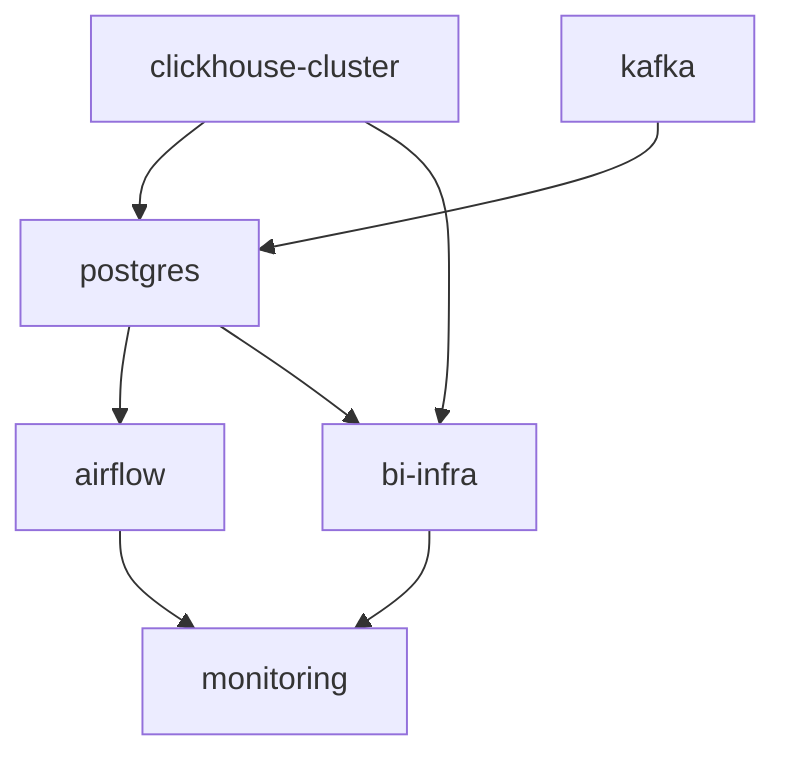

# EnergyHub: ClickHouse & Kafka Streaming Demo

**EnergyHub** — это комплексный демонстрационный проект, построенный на принципах Infrastructure as Code (IaC) с использованием Terraform. Он разворачивает полноценную аналитическую платформу для обработки и визуализации данных в реальном времени, имитируя сценарии из сферы энергетики.

Проект включает в себя кластер ClickHouse, брокер сообщений Apache Kafka для стриминга данных, централизованную PostgreSQL базу данных, современный Apache Airflow 3.0.4 для оркестрации задач и набор BI-инструментов (Metabase, Superset) для анализа и визуализации.

## 🚀 Особенности

- **Модульная архитектура:** Вся инфраструктура разделена на независимые, переиспользуемые Terraform-модули (`clickhouse-cluster`, `kafka`, `postgres`, `airflow`, `bi-infra`, `monitoring`).
- **Готовность к Production:** Настройки включают репликацию и шардирование для ClickHouse, аутентификацию для Kafka, централизованную PostgreSQL БД, современный Airflow 3.0.4 с улучшенными health checks.
- **Гибкость развертывания:** Возможность выборочно включать и отключать компоненты (Metabase, Superset, Airflow) и выбирать режимы хранения данных (локальный, удаленный S3, локальный бэкап).
- **Автоматизация "из коробки":** Автоматическая инициализация баз данных, создание пользователей, настройка сервисов и подключений между компонентами.
- **ETL/ELT пайплайны:** Apache Airflow 3.0.4 с готовыми DAG'ами для интеграции ClickHouse и Kafka.
- **CI/CD:** Встроенный пайплайн GitHub Actions для автоматической проверки и валидации Terraform-кода.
- **Реалистичная генерация данных:** Python-скрипты имитируют потоковую передачу данных о торгах на энергобирже и гидрологических данных с ГЭС.

## 🏛️ Архитектура

Проект состоит из шести основных модульных компонентов, которые разворачиваются в Docker:

1.  **Кластер ClickHouse (`clickhouse-cluster`):**
    - Основа аналитической платформы для обработки больших объемов данных.
    - Включает 4 ноды ClickHouse (2 шарда по 2 реплики) и 3 ноды ClickHouse Keeper для координации.
    - Поддерживает различные конфигурации хранения, включая локальный диск и S3-совместимые хранилища.
    - [Подробнее в README модуля...](./infra/terraform/modules/clickhouse-cluster/README.md)

2.  **Apache Kafka (`kafka`):**
    - Брокер сообщений для сбора и передачи данных в реальном времени.
    - Разворачивается с Zookeeper, SSL/TLS шифрованием, SASL/SCRAM аутентификацией и автоматическим созданием топиков с TTL.
    - Поддерживает смешанную конфигурацию протоколов: PLAINTEXT для внутренних операций и SASL_SSL для внешних клиентов.
    - Автоматическая генерация SSL-сертификатов и конфигурационных файлов для клиентов.
    - [Подробнее в README модуля...](./infra/terraform/modules/kafka/README.md)

3.  **PostgreSQL (`postgres`):**
    - Централизованная база данных для метаданных всех сервисов.
    - Единый экземпляр PostgreSQL с отдельными пользователями и базами данных для каждого сервиса.
    - Автоматическое создание пользователей и баз данных для Metabase, Superset и Apache Airflow.
    - Production-ready конфигурация с health checks и персистентным хранением.
    - [Подробнее в README модуля...](./infra/terraform/modules/postgres/README.md)

4.  **Apache Airflow 3.0.4 (`airflow`):**
    - Современная платформа для оркестрации и планирования задач обработки данных.
    - Новая архитектура 3.0.4 с отдельными компонентами: API Server, Scheduler, DAG Processor, Worker, Triggerer.
    - Автоматическая интеграция с ClickHouse и Kafka для создания ETL/ELT пайплайнов.
    - Использует PostgreSQL (из модуля postgres) для метаданных и Redis для Celery брокера.
    - Готовые DAG'ы для интеграции энергетических данных между ClickHouse и Kafka.
    - Улучшенные health checks и возможность отключения проблемных проверок.
    - [Подробнее в README модуля...](./infra/terraform/modules/airflow/README.md)

5.  **BI-инфраструктура (`bi-infra`):**
    - Предоставляет инструменты для визуализации данных из ClickHouse.
    - Использует PostgreSQL (из модуля postgres) в качестве бэкенда для метаданных.
    - Позволяет развернуть Metabase и/или Apache Superset.
    - Автоматическая настройка подключений к ClickHouse и интеграция с PostgreSQL.
    - [Подробнее в README модуля...](./infra/terraform/modules/bi-infra/README.md)

6.  **Мониторинг (`monitoring`):**
    - Разворачивает Portainer Community Edition для удобного управления и мониторинга всех Docker-контейнеров.
    - Предоставляет веб-интерфейс для управления контейнерами, просмотра логов и мониторинга ресурсов.
    - Поддерживает как HTTP, так и HTTPS доступ с персистентным хранилищем настроек.
    - [Подробнее в README модуля...](./infra/terraform/modules/monitoring/README.md)

## 🔄 Порядок развертывания и зависимости

Модули разворачиваются в следующем порядке с учетом зависимостей:



1. **Независимые модули** (развертываются параллельно):
   - `clickhouse-cluster` — основное хранилище данных
   - `kafka` — потоковая передача данных

2. **PostgreSQL** (`postgres`):
   - Зависит от готовности базовой инфраструктуры
   - Создает централизованную БД для всех сервисов

3. **Зависимые сервисы** (развертываются после PostgreSQL):
   - `airflow` — использует PostgreSQL для метаданных
   - `bi-infra` — использует PostgreSQL для Metabase/Superset

4. **Мониторинг** (`monitoring`):
   - Развертывается последним для мониторинга всех компонентов

## ⚡ Быстрый старт

Для полного пошагового руководства по развертыванию проекта на локальной машине, пожалуйста, обратитесь к нашему туториалу:

➡️ **[TUTORIAL.md](./TUTORIAL.md)**

## 🌐 Доступные сервисы

После успешного развертывания будут доступны следующие веб-интерфейсы:

| Сервис | URL | Описание | Логин | Пароль |
|--------|-----|----------|-------|---------|
| **Apache Airflow** | `http://localhost:8080` | Оркестрация задач и DAG'ов | `admin` | из `terraform.tfvars` |
| **Airflow Flower** | `http://localhost:5555` | Мониторинг Celery воркеров | — | — |
| **Metabase** | `http://localhost:3000` | BI-инструмент для визуализации | Первичная настройка | При первом входе |
| **Apache Superset** | `http://localhost:8088` | Продвинутая BI-платформа | `admin` | из `terraform.tfvars` |
| **Portainer** | `http://localhost:9443` | Управление Docker контейнерами | `admin` | Создается при первом входе |

### Базы данных и брокеры
| Сервис | Эндпоинт | Протокол | Описание |
|--------|----------|----------|----------|
| **ClickHouse HTTP** | `http://localhost:8123` | HTTP | Запросы к ClickHouse |
| **ClickHouse TCP** | `localhost:9000` | TCP | Нативный протокол ClickHouse |
| **Kafka External** | `localhost:9093` | SASL_SSL | Внешние клиенты Kafka |
| **PostgreSQL** | `localhost:5432` | PostgreSQL | Централизованная БД |
| **Redis** | `localhost:6379` | Redis | Celery брокер для Airflow |

## 🛠️ Управление

Вся инфраструктура управляется через Terraform из директории `infra/terraform`. Основные команды:
- `terraform init`: инициализация проекта.
- `terraform apply`: развертывание или обновление инфраструктуры.
- `terraform destroy`: полное удаление всех созданных ресурсов.

### Управление отдельными модулями

Вы можете управлять отдельными частями инфраструктуры с помощью флага `-target`:

```bash
# Развертывание только ClickHouse кластера
terraform apply -target="module.clickhouse_cluster"

# Развертывание только PostgreSQL
terraform apply -target="module.postgres"

# Развертывание только Apache Airflow
terraform apply -target="module.airflow"

# Развертывание только BI-инструментов
terraform apply -target="module.bi_infra"

# Развертывание только системы мониторинга
terraform apply -target="module.monitoring"

# Развертывание только Kafka
terraform apply -target="module.kafka"
```

### Полезные команды для диагностики

```bash
# Проверка статуса всех контейнеров
docker ps --format "table {{.Names}}\t{{.Status}}\t{{.Ports}}"

# Проверка логов конкретного сервиса
docker logs airflow-api-server
docker logs postgres
docker logs kafka

# Проверка сетевых подключений
docker network ls | grep -E "(clickhouse|kafka|postgres|airflow)"

# Проверка health checks
curl http://localhost:8080/health          # Airflow
curl http://localhost:8123/ping            # ClickHouse
curl http://localhost:3000/api/health      # Metabase
```
