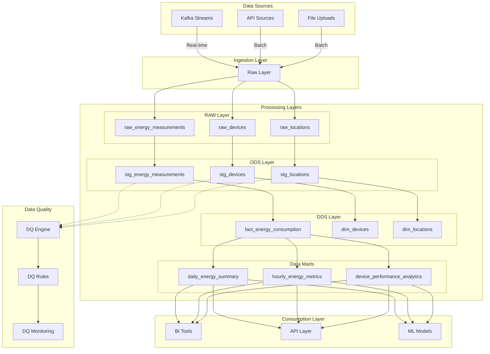

# ClickHouse EnergyHub - Архитектура DWH

## 🏗️ Обзор архитектуры

ClickHouse EnergyHub использует современную многослойную архитектуру Data Warehouse (DWH) с четким разделением ответственности между слоями. Архитектура построена на принципах Data Vault и Kimball, адаптированных для ClickHouse.

## 📊 Схема архитектуры DWH



## 🎯 Слои данных

### 1. RAW Layer (Сырые данные)

**Назначение**: Хранение данных в исходном виде без изменений

**Характеристики**:
- Материализация: `VIEW`
- Схема: `raw`
- Теги: `["raw", "kafka_data"]`
- DQ проверки: Отсутствуют
- Обновление: В реальном времени

**Модели**:
- `raw_energy_measurements` - Измерения энергопотребления из Kafka
- `raw_devices` - Данные об устройствах из Kafka
- `raw_locations` - Справочник локаций

**Особенности**:
- Данные не изменяются
- Сохраняется оригинальный формат
- Быстрый доступ к исходным данным
- Фильтрация по времени (последние 30 дней)

### 2. ODS Layer (Operational Data Store)

**Назначение**: Предобработка данных с DQ проверками и базовой очисткой

**Характеристики**:
- Материализация: `VIEW`
- Схема: `ods`
- Теги: `["ods", "staging", "dq_checked"]`
- DQ проверки: Обязательны
- Обновление: При изменении RAW данных

**Модели**:
- `stg_energy_measurements` - Staging измерений энергии
- `stg_devices` - Staging устройств
- `stg_locations` - Staging локаций

**DQ проверки**:
- Полнота критических полей
- Диапазон значений
- Бизнес-правила
- Согласованность данных
- Временная последовательность

**Порог качества**: DQ score ≥ 0.7

### 3. DDS Layer (Detailed Data Store)

**Назначение**: Детальный слой с применением бизнес-логики

**Характеристики**:
- Материализация: `TABLE`
- Схема: `dds`
- Теги: `["dds", "detailed", "business_logic"]`
- DQ проверки: Наследуются от ODS
- Обновление: Ежедневно или по расписанию

**Модели**:
- `dim_locations` - Dimension таблица локаций
- `dim_devices` - Dimension таблица устройств
- `fact_energy_consumption` - Fact таблица потребления энергии

**Бизнес-логика**:
- Обогащение данными о временных зонах
- Расчет электрических параметров
- Классификация по времени и сезонам
- Нормализация энергопотребления

**Порог качества**: DQ score ≥ 0.8

### 4. Data Marts Layer

**Назначение**: Готовые агрегированные данные для BI и аналитики

**Характеристики**:
- Материализация: `TABLE`
- Схема: `data_marts`
- Теги: `["data_marts", "aggregated", "bi_ready"]`
- DQ проверки: Наследуются от DDS
- Обновление: Ежедневно

**Модели**:
- `daily_energy_summary` - Ежедневная сводка
- `hourly_energy_metrics` - Почасовые метрики
- `device_performance_analytics` - Аналитика производительности

**Агрегации**:
- По времени (час, день, месяц, сезон)
- По географии (регион, город, страна)
- По устройствам (тип, производитель)
- По эффективности (коэффициент мощности)

**Порог качества**: DQ score ≥ 0.9

## 🔄 Потоки данных

### Real-time поток
```
Kafka → RAW → ODS → DDS → Data Marts
  ↓      ↓     ↓     ↓       ↓
Real   Real  Real  Batch   Batch
```

### Batch поток
```
Files → RAW → ODS → DDS → Data Marts
  ↓      ↓     ↓     ↓       ↓
Batch  Batch Batch Batch   Batch
```

## 📊 Data Quality Framework

### DQ Score Calculation

```sql
DQ Score = (
    Completeness_Score * 0.4 +
    Business_Rules_Score * 0.4 +
    Format_Score * 0.2
)
```

### DQ Rules by Layer

| Слой | Полнота | Бизнес-правила | Формат | Минимальный DQ Score |
|------|---------|----------------|---------|---------------------|
| RAW  | ❌      | ❌             | ❌      | Нет                 |
| ODS  | ✅      | ✅             | ✅      | 0.7                 |
| DDS  | ✅      | ✅             | ✅      | 0.8                 |
| Marts| ✅      | ✅             | ✅      | 0.9                 |

### DQ Monitoring

- **Автоматические алерты** при превышении порогов
- **Логирование результатов** в `dq_checks.dq_test_summary`
- **Интеграция с системами мониторинга**
- **Отчеты по качеству данных**

## 🚀 Оптимизация ClickHouse

### Индексы

```sql
-- MinMax индекс для временных полей
INDEX idx_timestamp timestamp TYPE minmax GRANULARITY 1

-- Set индекс для категориальных полей
INDEX idx_region region TYPE set(1000) GRANULARITY 1

-- Bloom Filter для текстовых полей
INDEX idx_device_name device_name TYPE bloom_filter GRANULARITY 1
```

### Партиционирование

```sql
-- По дате (ежемесячно)
PARTITION BY toYYYYMM(timestamp)

-- По региону (географически)
PARTITION BY region
```

### Движки таблиц

- **MergeTree** - Основной движок для fact таблиц
- **ReplacingMergeTree** - Для обновляемых данных
- **AggregatingMergeTree** - Для агрегированных данных

## 🔧 Техническая реализация

### Макросы

- **`dq_utils.sql`** - Утилиты для DQ проверок
- **`clickhouse_utils.sql`** - Специфичные для ClickHouse операции
- **`incremental_utils.sql`** - Макросы для инкрементальной загрузки
- **`model_utils.sql`** - Общие утилиты для моделей

### Тесты

- **Generic тесты** - Стандартные dbt тесты
- **Custom тесты** - Специализированные для DQ проверок
- **Data Quality тесты** - Проверка качества данных

### Конфигурация

```yaml
# dbt_project.yml
models:
  clickhouse_energyhub:
    raw:
      +materialized: view
      +schema: raw
      +tags: ["raw", "kafka_data"]
    ods:
      +materialized: view
      +schema: ods
      +tags: ["ods", "preprocessed", "dq_checked"]
    dds:
      +materialized: table
      +schema: dds
      +tags: ["dds", "detailed", "business_logic"]
    data_marts:
      +materialized: table
      +schema: data_marts
      +tags: ["data_marts", "aggregated", "bi_ready"]
```

## 📈 Метрики и KPI

### Операционные метрики

- **Время загрузки данных** по слоям
- **Размер данных** по слоям и таблицам
- **Количество записей** обрабатываемых в день
- **Производительность запросов**

### Качественные метрики

- **DQ Score** по моделям и слоям
- **Количество проваленных DQ проверок**
- **Время исправления DQ проблем**
- **Процент качественных данных**

### Бизнес-метрики

- **Энергопотребление** по регионам и устройствам
- **Эффективность энергопотребления**
- **Аномалии в данных**
- **Тренды энергопотребления**

## 🔍 Мониторинг и алертинг

### Логирование

- **dbt логи** - Основные логи выполнения
- **DQ логи** - Результаты DQ проверок
- **ClickHouse логи** - Системные логи ClickHouse

### Алертинг

- **DQ failures** - При превышении порогов качества
- **Performance issues** - При медленной работе моделей
- **Data freshness** - При устаревании данных
- **System health** - При проблемах с инфраструктурой

### Дашборды

- **DQ Dashboard** - Мониторинг качества данных
- **Performance Dashboard** - Производительность системы
- **Business Dashboard** - Бизнес-метрики

## 🚀 Лучшие практики

### Разработка моделей

1. **Следуйте принципам слоистой архитектуры**
2. **Используйте теги для группировки моделей**
3. **Документируйте бизнес-логику**
4. **Тестируйте все модели**

### DQ проверки

1. **Настраивайте пороги в зависимости от окружения**
2. **Мониторьте результаты DQ проверок**
3. **Автоматизируйте исправление проблем**
4. **Документируйте бизнес-правила**

### Оптимизация

1. **Используйте подходящие индексы**
2. **Настраивайте партиционирование**
3. **Оптимизируйте запросы**
4. **Мониторьте производительность**

## 🔮 Roadmap

### Краткосрочные планы (1-3 месяца)

- [ ] Добавление новых DQ проверок
- [ ] Оптимизация производительности
- [ ] Расширение мониторинга

### Среднесрочные планы (3-6 месяцев)

- [ ] Интеграция с ML моделями
- [ ] Расширение Data Marts
- [ ] Автоматизация DQ исправлений

### Долгосрочные планы (6+ месяцев)

- [ ] Real-time Data Marts
- [ ] Интеграция с внешними системами
- [ ] Расширенная аналитика

## 📚 Дополнительные ресурсы

- [dbt документация](README.md) - Основная документация dbt модуля
- [Примеры запросов](examples/example_queries.sql) - Готовые SQL запросы
- [Схема тестов](models/ods/schema.yml) - Конфигурация тестов
- [Макросы](macros/) - Описание всех макросов

---

**Версия документации**: 1.0.0  
**Последнее обновление**: 2025-01-27  
**Статус**: Активная разработка
