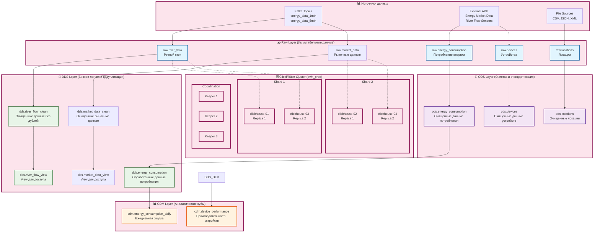

# 🏗️ Архитектура Data Warehouse (DWH)

## Обзор системы

ClickHouse EnergyHub представляет собой современную архитектуру Data Warehouse, обеспечивающую высокую производительность, масштабируемость и гибкость для энергетической отрасли.

## 🏛️ Архитектурные слои

### Общая архитектура Data Warehouse



### Детальная схема потоков данных

```mermaid
flowchart TD
    %% Источники
    subgraph "🌊 Источники данных"
        KAFKA_1MIN[Kafka: energy_data_1min<br/>Речной сток каждую минуту]
        KAFKA_5MIN[Kafka: energy_data_5min<br/>Рыночные данные каждые 5 мин]
        SENSORS[IoT Sensors<br/>Речные датчики<br/>Энергетические счетчики]
        MARKET_API[Energy Market API<br/>Цены, объемы, зоны]
    end
    
    %% Airflow DAG'и
    subgraph "🔄 Airflow Orchestration"
        DAG_DEDUP[deduplication_pipeline<br/>Каждые 5 минут]
        DAG_BACKUP[clickhouse_backup_pipeline<br/>Ежедневно]
        DAG_DBT[dbt_pipeline<br/>По расписанию]
        DAG_DATA[data_processing_pipeline<br/>Непрерывно]
    end
    
    %% ClickHouse таблицы
    subgraph "🗄️ ClickHouse Tables"
        subgraph "Raw Layer"
            RAW_RF[raw.river_flow<br/>timestamp, river_name, ges_name<br/>water_level_m, flow_rate_m3_s, power_output_mw]
            RAW_EC[raw.energy_consumption<br/>device_id, location_id, timestamp<br/>energy_kwh, voltage, current_amp, power_factor]
            RAW_DEV[raw.devices<br/>device_id, device_name, device_type<br/>manufacturer, model, specifications]
            RAW_LOC[raw.locations<br/>location_id, location_name, region<br/>city, country, coordinates]
        end
        
        subgraph "ODS Layer"
            ODS_EC[ods.energy_consumption<br/>Очищенные данные потребления<br/>Бизнес-правила и валидация]
            ODS_DEV[ods.devices<br/>Очищенные данные устройств<br/>Стандартизация и обогащение]
            ODS_LOC[ods.locations<br/>Очищенные локации<br/>Геокодирование и нормализация]
        end
        
        subgraph "DDS Layer"
            DDS_RF_CLEAN[dds.river_flow_clean<br/>Дедуплицированные данные<br/>ROW_NUMBER() OVER (PARTITION BY ges_name, timestamp, river_name)]
            DDS_MD_CLEAN[dds.market_data_clean<br/>Дедуплицированные данные<br/>Ключи: timestamp, trading_zone]
            DDS_EC[dds.energy_consumption<br/>Обработанные данные потребления<br/>Аномалии, категоризация, агрегация]
            DDS_RF_VIEW[dds.river_flow_view<br/>View для доступа к очищенным данным]
            DDS_MD_VIEW[dds.market_data_view<br/>View для доступа к очищенным данным]
        end
        
        subgraph "CDM Layer"
            CDM_EC_DAILY[cdm.energy_consumption_daily<br/>Ежедневная агрегация<br/>total_energy_kwh, avg_energy_kwh, anomaly_percentages]
            CDM_DEV_PERF[cdm.device_performance<br/>KPI устройств<br/>efficiency, uptime, maintenance_needed]
        end
    end
    
    %% dbt модели
    subgraph "🧹 dbt Models"
        DBT_RAW[raw_* models<br/>Загрузка из Kafka]
        DBT_ODS[ods_* models<br/>Очистка и стандартизация]
        DBT_DDS[dds_* models<br/>Бизнес-логика и дедупликация]
        DBT_CDM[cdm_* models<br/>Агрегация и аналитика]
    end
    
    %% Потоки
    KAFKA_1MIN --> DAG_DATA
    KAFKA_5MIN --> DAG_DATA
    SENSORS --> DAG_DATA
    MARKET_API --> DAG_DATA
    
    DAG_DATA --> RAW_RF
    DAG_DATA --> RAW_EC
    DAG_DATA --> RAW_DEV
    DAG_DATA --> RAW_LOC
    
    %% Трансформации через dbt
    RAW_EC --> DBT_ODS
    RAW_DEV --> DBT_ODS
    RAW_LOC --> DBT_ODS
    
    DBT_ODS --> ODS_EC
    DBT_ODS --> ODS_DEV
    DBT_ODS --> ODS_LOC
    
    RAW_RF --> DAG_DEDUP
    RAW_EC --> DAG_DEDUP
    
    DAG_DEDUP --> DBT_DDS
    DBT_DDS --> DDS_RF_CLEAN
    DBT_DDS --> DDS_EC
    
    DDS_RF_CLEAN --> DDS_RF_VIEW
    DDS_EC --> DBT_CDM
    DBT_CDM --> CDM_EC_DAILY
    DBT_CDM --> CDM_DEV_PERF
    
    %% Автоматизация
    DAG_DEDUP --> DBT_RAW
    DAG_DEDUP --> DBT_ODS
    
    %% Стили
    classDef source fill:#e3f2fd,stroke:#1976d2,stroke-width:2px
    classDef airflow fill:#ffebee,stroke:#c62828,stroke-width:2px
    classDef clickhouse fill:#e8f5e8,stroke:#2e7d32,stroke-width:2px
    classDef dbt fill:#fff8e1,stroke:#f57f17,stroke-width:2px
    
    class KAFKA_1MIN,KAFKA_5MIN,SENSORS,MARKET_API source
    class DAG_DEDUP,DAG_BACKUP,DAG_DBT,DAG_DATA airflow
    class RAW_RF,RAW_MD,DDS_RF_CLEAN,DDS_MD_CLEAN,CDM_EC_DAILY,CDM_DEV_PERF clickhouse
    class DBT_RAW,DBT_ODS,DBT_DDS,DBT_CDM dbt
```

### Нейминг конвенции

**Raw Layer:**
- Таблицы: `raw_[entity_name]`
- Колонки: `[original_name]` (без префиксов)
- Индексы: `idx_[table]_[columns]`

**ODS Layer:**
- Таблицы: `ods_[entity_name]`
- Колонки: `[standardized_name]`
- Индексы: `idx_ods_[table]_[columns]`

**DDS Layer:**
- Таблицы: `dds_[entity_name]_[suffix]`
- Колонки: `[business_name]`
- Индексы: `idx_dds_[table]_[columns]`

**CDM Layer:**
- Таблицы: `cdm_[granularity]_[entity]_[type]`
- Колонки: `[metric_name]` или `[dimension_name]`
- Индексы: `idx_cdm_[table]_[columns]`

## 🔄 Поток данных

```
External Sources → Raw Layer → ODS Layer → DDS Layer → CDM Layer → BI Tools
     ↓              ↓          ↓          ↓          ↓          ↓
  Ingestion    Validation  Cleaning   Business    Analytics  Reporting
              & Audit     & ETL      Logic      & Aggregation
```

### Детализация потоков:

#### 1. **Ingestion Flow**
```
API/File → Kafka → Raw Tables → Validation → ODS Tables
```

#### 2. **Processing Flow**
```
ODS → dbt Models → DDS Clean Tables → Business Logic → DDS Views
```

#### 3. **Analytics Flow**
```
DDS → Aggregation → CDM Tables → BI Tools → Dashboards
```

## 🏗️ Технологический стек

### **База данных**
- **ClickHouse** - основная СУБД для аналитики
- **PostgreSQL** - метаданные и конфигурация
- **Redis** - кэширование и очереди

### **Оркестрация**
- **Apache Airflow** - планировщик задач
- **dbt** - трансформация данных
- **Kafka** - потоковая обработка

### **Визуализация**
- **Apache Superset** - аналитические дашборды
- **Metabase** - самообслуживание аналитики
- **Grafana** - мониторинг и алерты

### **Инфраструктура**
- **Docker** - контейнеризация
- **Terraform** - инфраструктура как код
- **Portainer** - управление контейнерами

## 📊 Модели данных

### **Entity-Relationship Model**

```
┌─────────────────┐    ┌─────────────────┐    ┌─────────────────┐
│    Locations    │    │     Devices     │    │ Energy Meters   │
├─────────────────┤    ├─────────────────┤    ├─────────────────┤
│ location_id (PK)│◄───┤ location_id (FK)│◄───┤ device_id (FK)  │
│ location_name   │    │ device_id (PK)  │    │ meter_id (PK)   │
│ region          │    │ device_type     │    │ timestamp       │
│ coordinates     │    │ manufacturer    │    │ energy_kwh      │
└─────────────────┘    └─────────────────┘    └─────────────────┘
         │                       │                       │
         │                       │                       │
         ▼                       ▼                       ▼
┌─────────────────┐    ┌─────────────────┐    ┌─────────────────┐
│   River Flow    │    │ Market Data     │    │ Energy Prices   │
├─────────────────┤    ├─────────────────┤    ├─────────────────┤
│ flow_id (PK)    │    │ market_id (PK)  │    │ price_id (PK)   │
│ location_id (FK)│    │ timestamp       │    │ timestamp       │
│ timestamp       │    │ trading_zone    │    │ region          │
│ water_level     │    │ volume_mwh      │    │ price_eur_mwh   │
│ flow_rate       │    │ price_eur_mwh   │    └─────────────────┘
└─────────────────┘    └─────────────────┘
```

### **Dimensional Model (CDM)**

```
┌─────────────────────────────────────────────────────────────┐
│                    Fact Table: Energy Facts                 │
├─────────────────────────────────────────────────────────────┤
│ fact_id (PK)                                                │
│ timestamp (FK) → Date Dimension                             │
│ location_id (FK) → Location Dimension                       │
│ device_id (FK) → Device Dimension                           │
│ energy_kwh (Measure)                                        │
│ cost_eur (Measure)                                          │
│ efficiency_ratio (Measure)                                  │
└─────────────────────────────────────────────────────────────┘
                              │
                              ▼
┌─────────────────┐    ┌─────────────────┐    ┌─────────────────┐
│ Date Dimension  │    │Location Dimension    │Device Dimension │
├─────────────────┤    ├─────────────────┤    ├─────────────────┤
│ date_id (PK)    │    │ location_id (PK)│    │ device_id (PK)  │
│ date            │    │ location_name   │    │ device_name     │
│ day_of_week     │    │ region          │    │ device_type     │
│ month           │    │ city            │    │ manufacturer    │
│ quarter         │    │ country         │    │ model           │
│ year            │    │ coordinates     │    │ capacity_mw     │
└─────────────────┘    └─────────────────┘    └─────────────────┘
```

## 🎯 Нейминг конвенции

### **Общие принципы**
- **Snake_case** для всех имен
- **Префиксы** для обозначения слоя
- **Суффиксы** для типа объекта
- **Английский язык** для всех имен

### **Слои данных**
```
raw_*          # Сырые данные
ods_*          # Операционные данные
dds_*_clean    # Очищенные детализированные данные
dds_*_view     # Представления над данными
cdm_*_*        # Конформированные данные
```

### **Типы объектов**
```
*_local        # Локальные таблицы ClickHouse
*_mv           # Materialized Views
*_view         # Обычные представления
*_clean        # Очищенные данные
*_summary      # Сводные данные
*_analytics    # Аналитические данные
```

### **Колонки**
```
*_id           # Идентификаторы (PK/FK)
*_name         # Названия
*_type         # Типы
*_date         # Даты
*_timestamp    # Временные метки
*_amount       # Количества
*_price        # Цены
*_rate         # Ставки
*_level        # Уровни
*_status       # Статусы
*_created_at   # Время создания
*_updated_at   # Время обновления
```

### **Индексы**
```
idx_[table]_[columns]           # Обычные индексы
idx_[table]_[columns]_partial   # Частичные индексы
idx_[table]_[columns]_unique    # Уникальные индексы
```

## 🔧 Конфигурация ClickHouse

### **Движки таблиц**
```sql
-- Для Raw и ODS слоев
ENGINE = MergeTree()
PARTITION BY toYYYYMM(timestamp)
ORDER BY (timestamp, entity_id)

-- Для DDS слоев
ENGINE = ReplicatedMergeTree('/clickhouse/tables/{shard}/table_name', '{replica}')
PARTITION BY toYYYYMM(timestamp)
ORDER BY (business_key, timestamp)

-- Для CDM слоев
ENGINE = ReplicatedSummingMergeTree('/clickhouse/tables/{shard}/table_name', '{replica}')
PARTITION BY toYYYYMM(timestamp)
ORDER BY (dimension_keys)
```

### **Настройки производительности**
```sql
-- Оптимизация для аналитических запросов
SET optimize_aggregation_in_order = 1;
SET max_threads = 8;
SET max_memory_usage = 8589934592; -- 8GB
```

## 📈 Мониторинг и метрики

### **Ключевые метрики**
- **Data Freshness** - актуальность данных
- **Data Quality** - качество данных
- **Processing Time** - время обработки
- **Error Rate** - частота ошибок
- **Storage Usage** - использование хранилища

### **Алерты**
- **Data Pipeline Failures** - сбои в пайплайнах
- **Data Quality Issues** - проблемы с качеством
- **Performance Degradation** - деградация производительности
- **Storage Thresholds** - превышение лимитов хранилища

## 🔮 Планы развития

### **Краткосрочные (3-6 месяцев)**
- [ ] Реализация Data Lineage
- [ ] Автоматизация тестирования данных
- [ ] Улучшение мониторинга

### **Среднесрочные (6-12 месяцев)**
- [ ] Внедрение Machine Learning
- [ ] Реализация Real-time Analytics
- [ ] Расширение интеграций

### **Долгосрочные (1+ год)**
- [ ] Multi-cloud архитектура
- [ ] Advanced Analytics Platform
- [ ] AI-powered Insights

## 📚 Дополнительные ресурсы

- [Quick Start Guide](../QUICK_START.md) - Быстрый старт
- [DBT Integration](DBT_INTEGRATION.md) - Интеграция с dbt
- [Monitoring Guide](MONITORING.md) - Мониторинг системы
- [CI/CD Pipeline](CI_CD.md) - Автоматизация развертывания
