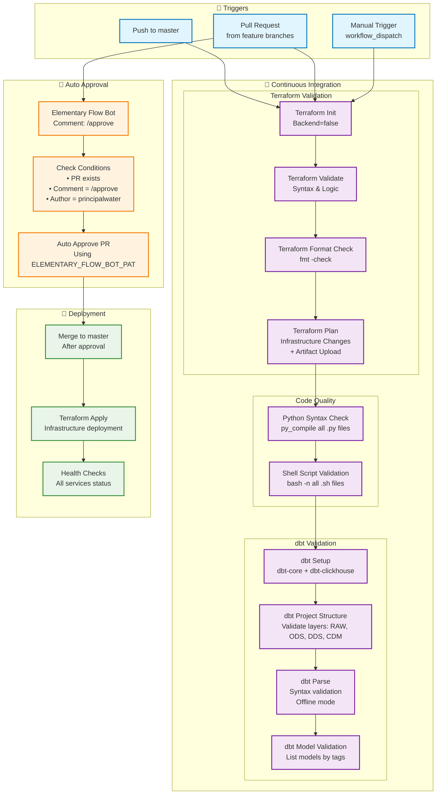

# 🚀 CI/CD Pipeline

## Обзор

ClickHouse EnergyHub использует современные практики **Continuous Integration** и **Continuous Deployment** для автоматизации разработки, тестирования и развертывания. Это обеспечивает высокое качество кода, быструю доставку изменений и надежность системы.

## 🏗️ Архитектура CI/CD

### Общая архитектура CI/CD Pipeline

```mermaid
graph TB
    %% Разработчик
    subgraph "👨‍💻 Development"
        principalwater[Vladislav Kuzmin<br/>Developer<br/>All Features & Infrastructure]
    end
    
    %% GitHub Repository
    subgraph "📚 GitHub Repository"
        MASTER[master branch<br/>Production Ready<br/>Default Branch]
        BI_INFRA[bi-infra branch<br/>BI Infrastructure<br/>Superset, Metabase]
        KAFKA_INFRA[kafka-infra branch<br/>Kafka Infrastructure<br/>SSL, SASL, ACL]
        AIRFLOW_INFRA[airflow-infra branch<br/>Airflow Infrastructure<br/>3.0.4, Celery]
        DBT_INFRA[dbt-infra branch<br/>dbt Infrastructure<br/>Models, Tests]
        DATA_INFRA[data-infra branch<br/>Data Infrastructure<br/>ClickHouse, PostgreSQL]
        ADDITIONAL_INFRA[additional-infra branch<br/>Additional Services<br/>Monitoring, Backup]
    end
    
    %% GitHub Actions
    subgraph "🔄 GitHub Actions CI/CD"
        subgraph "CI Pipeline (ci.yml)"
            CHECKOUT[Checkout Code]
            TERRAFORM_SETUP[Setup Terraform 1.7.5]
            TERRAFORM_VALIDATE[Terraform Validate<br/>Format Check]
            TERRAFORM_PLAN[Terraform Plan<br/>Infrastructure Changes]
            PYTHON_LINT[Python Syntax Check<br/>Shell Script Validation]
            DBT_CHECK[dbt Project Validation<br/>Model Structure Check]
        end
        
        subgraph "Auto Approve (approve.yml)"
            BOT_COMMENT[Elementary Flow Bot<br/>Comment: /approve]
            AUTO_APPROVE[Auto Approve PR<br/>Using Bot PAT]
        end
    end
    
    %% Инфраструктура
    subgraph "🏗️ Infrastructure (Terraform)"
        subgraph "ClickHouse Cluster"
            CH_CLUSTER[4 Nodes + 3 Keeper<br/>ReplicatedMergeTree<br/>Distributed Tables]
        end
        
        subgraph "Data Processing"
            AIRFLOW[Apache Airflow 3.0.4<br/>Celery Workers<br/>PostgreSQL Backend]
            DBT[dbt Core + ClickHouse<br/>4 Data Layers<br/>RAW, ODS, DDS, CDM]
            KAFKA[Apache Kafka<br/>SSL + SASL<br/>2 Topics]
        end
        
        subgraph "BI & Monitoring"
            SUPERSET[Apache Superset<br/>Analytics Dashboards]
            METABASE[Metabase<br/>Self-Service BI]
            POSTGRES[PostgreSQL<br/>Centralized DB]
            PORTAINER[Portainer<br/>Container Management]
        end
    end
    
    %% Потоки разработки
    principalwater --> BI_INFRA
    principalwater --> KAFKA_INFRA
    principalwater --> AIRFLOW_INFRA
    principalwater --> DBT_INFRA
    principalwater --> DATA_INFRA
    principalwater --> ADDITIONAL_INFRA
    
    BI_INFRA --> MASTER
    KAFKA_INFRA --> MASTER
    AIRFLOW_INFRA --> MASTER
    DBT_INFRA --> MASTER
    DATA_INFRA --> MASTER
    ADDITIONAL_INFRA --> MASTER
    
    %% CI/CD потоки
    BI_INFRA --> CHECKOUT
    KAFKA_INFRA --> CHECKOUT
    AIRFLOW_INFRA --> CHECKOUT
    DBT_INFRA --> CHECKOUT
    DATA_INFRA --> CHECKOUT
    ADDITIONAL_INFRA --> CHECKOUT
    
    CHECKOUT --> TERRAFORM_SETUP
    TERRAFORM_SETUP --> TERRAFORM_VALIDATE
    TERRAFORM_VALIDATE --> TERRAFORM_PLAN
    TERRAFORM_PLAN --> PYTHON_LINT
    PYTHON_LINT --> DBT_CHECK
    
    %% Auto Approve
    principalwater --> BOT_COMMENT
    BOT_COMMENT --> AUTO_APPROVE
    AUTO_APPROVE --> MASTER
    
    %% Инфраструктура
    TERRAFORM_PLAN --> CH_CLUSTER
    TERRAFORM_PLAN --> AIRFLOW
    TERRAFORM_PLAN --> DBT
    TERRAFORM_PLAN --> KAFKA
    TERRAFORM_PLAN --> SUPERSET
    TERRAFORM_PLAN --> METABASE
    TERRAFORM_PLAN --> POSTGRES
    TERRAFORM_PLAN --> PORTAINER
    
    %% Стили
    classDef dev fill:#e3f2fd,stroke:#1976d2,stroke-width:2px
    classDef github fill:#fce4ec,stroke:#c2185b,stroke-width:2px
    classDef ci fill:#fff3e0,stroke:#f57c00,stroke-width:2px
    classDef infra fill:#e8f5e8,stroke:#388e3c,stroke-width:2px
    classDef bot fill:#f3e5f5,stroke:#7b1fa2,stroke-width:2px
    
    class principalwater dev
    class MASTER,BI_INFRA,KAFKA_INFRA,AIRFLOW_INFRA,DBT_INFRA,DATA_INFRA,ADDITIONAL_INFRA github
    class CHECKOUT,TERRAFORM_SETUP,TERRAFORM_VALIDATE,TERRAFORM_PLAN,PYTHON_LINT,DBT_CHECK ci
    class BOT_COMMENT,AUTO_APPROVE bot
    class CH_CLUSTER,AIRFLOW,DBT,KAFKA,SUPERSET,METABASE,POSTGRES,PORTAINER infra
```



### Детальный поток CI/CD процессов



### Автоматизация и качество

**Quality Gates:**
- ✅ Terraform validation passed
- ✅ Python syntax check passed
- ✅ Shell script validation passed
- ✅ dbt project structure valid
- ✅ dbt models syntax valid

**🤖 Elementary Flow Bot**
Для автоматизации процесса одобрения Pull Request используется **Elementary Flow Bot** ([@elementary-flow-bot](https://github.com/elementary-flow-bot)), разработанный и подключенный к репозиторию. Бот автоматически одобряет PR при выполнении следующих условий:

- Комментарий `/approve` оставлен в Pull Request
- Автор комментария - `principalwater` (создатель репозитория)
- PR существует и готов к слиянию

**Процесс автоматического одобрения:**
1. Создание Pull Request из feature branch в master
2. Прохождение всех CI проверок (Terraform, Python, dbt)
3. Комментарий `/approve` от principalwater
4. Автоматическое одобрение Elementary Flow Bot
5. Слияние в master branch
6. Автоматическое развертывание инфраструктуры

## 🔄 Workflow GitHub Actions

### Основной CI/CD Pipeline

```yaml
# .github/workflows/main.yml
name: CI/CD Pipeline

on:
  push:
    branches: [ main, develop ]
  pull_request:
    branches: [ main, develop ]
  release:
    types: [ published ]

env:
  REGISTRY: ghcr.io
  IMAGE_NAME: ${{ github.repository }}

jobs:
  # Тестирование
  test:
    runs-on: ubuntu-latest
    steps:
      - uses: actions/checkout@v4
      
      - name: Setup Python
        uses: actions/setup-python@v4
        with:
          python-version: '3.11'
          
      - name: Install dependencies
        run: |
          python -m pip install --upgrade pip
          pip install -r requirements.txt
          pip install -r requirements-dev.txt
          
      - name: Run linting
        run: |
          flake8 .
          black --check .
          isort --check-only .
          
      - name: Run tests
        run: |
          pytest tests/ --cov=. --cov-report=xml
          
      - name: Upload coverage
        uses: codecov/codecov-action@v3
        with:
          file: ./coverage.xml

  # Безопасность
  security:
    runs-on: ubuntu-latest
    steps:
      - uses: actions/checkout@v4
      
      - name: Run security scan
        uses: github/codeql-action/init@v2
        with:
          languages: python, yaml, dockerfile
          
      - name: Perform CodeQL Analysis
        uses: github/codeql-action/analyze@v2
        
      - name: Run dependency check
        run: |
          pip install safety
          safety check

  # Развертывание (локальное)
  deploy:
    needs: [test, security]
    runs-on: ubuntu-latest
    if: github.event_name == 'push' && github.ref == 'refs/heads/main'
    
    steps:
      - uses: actions/checkout@v4
      
      - name: Setup Terraform
        uses: hashicorp/setup-terraform@v3
        with:
          terraform_version: '1.7.5'
          
      - name: Terraform Init
        run: |
          cd infra/terraform
          terraform init -backend=false
          
      - name: Terraform Plan
        run: |
          cd infra/terraform
          terraform plan -out=tfplan
          
      - name: Terraform Apply
        run: |
          cd infra/terraform
          terraform apply tfplan
```

### Pull Request Pipeline

В проекте используется **единый CI workflow** для всех проверок:

```yaml
# .github/workflows/ci.yml
name: Terraform & Python Lint CI

on:
  pull_request:
    branches: [ master ]
  push:
    branches: [ master ]

jobs:
  terraform:
    # Проверка Terraform конфигурации
    # Валидация синтаксиса и форматирования
    
  python-lint:
    # Проверка синтаксиса Python файлов
    # Валидация shell скриптов
    
  dbt-check:
    # Проверка структуры dbt проекта
    # Валидация моделей и макросов
```

**Преимущества единого workflow:**
- Централизованное управление проверками
- Автоматический запуск при PR и push
- Проверка всех компонентов в одном месте

## 🧪 Автоматизированное тестирование

### Текущее состояние тестирования

В проекте реализовано **базовое тестирование** через CI/CD pipeline:

#### 1. **Python Syntax Validation**
- Проверка синтаксиса всех Python файлов
- Валидация shell скриптов
- Автоматическая проверка при каждом PR

#### 2. **dbt Project Validation**
- Проверка структуры dbt проекта
- Валидация слоев данных (RAW, ODS, DDS, CDM)
- Проверка синтаксиса моделей
- Валидация макросов и тестов

#### 3. **Terraform Validation**
- Проверка синтаксиса Terraform
- Валидация конфигурации
- Проверка форматирования кода

### Планы по расширению тестирования

В будущем планируется добавить:
- Unit тесты для Python скриптов
- Интеграционные тесты для dbt моделей
- End-to-end тесты для полного пайплайна
- Покрытие кода тестами

## 🔒 Безопасность

### Текущие меры безопасности

В проекте реализованы **базовые меры безопасности**:

#### 1. **Secrets Management**
- Все чувствительные данные хранятся в GitHub Secrets
- Пароли и ключи не попадают в код
- Автоматическая подстановка переменных в CI/CD

#### 2. **Access Control**
- Автоматическое одобрение PR только от владельца репозитория
- Использование Personal Access Token для бота
- Ограниченные права доступа в workflows

#### 3. **Infrastructure Security**
- Terraform state не содержит чувствительных данных
- Локальное хранение для CI/CD контекста
- Валидация конфигурации перед применением

### Планы по расширению безопасности

В будущем планируется добавить:
- Сканирование уязвимостей в зависимостях
- Анализ безопасности кода (CodeQL)
- Сканирование контейнеров
- Автоматические security alerts

## 🚀 Автоматизация развертывания

### Terraform Automation

#### 1. **Infrastructure as Code**
```hcl
# infra/terraform/main.tf
terraform {
  required_version = ">= 1.0"
  required_providers {
    docker = {
      source  = "kreuzwerker/docker"
      version = "~> 3.0"
    }
  }
}

# Автоматическое создание ресурсов
resource "docker_network" "clickhouse_network" {
  name = "clickhouse-network"
}

resource "docker_container" "clickhouse_01" {
  name  = "clickhouse-01"
  image = docker_image.clickhouse.latest
  
  networks_advanced {
    name = docker_network.clickhouse_network.name
  }
  
  env = [
    "CLICKHOUSE_DB=default",
    "CLICKHOUSE_USER=${var.clickhouse_user}",
    "CLICKHOUSE_PASSWORD=${var.clickhouse_password}"
  ]
}
```

#### 2. **Environment Management**
```hcl
# infra/terraform/terraform.tfvars
environment = "local"
clickhouse_cluster_size = 4
airflow_workers = 2
monitoring_enabled = true
backup_retention_days = 7

# Локальное развертывание
storage_type = "local_storage"
local_paths = {
  clickhouse_base_path = "../../volumes/clickhouse"
  bi_postgres_data_path = "../../volumes/postgres/data"
}
```

### Deployment Strategies

#### 1. **Локальное развертывание**
```yaml
# .github/workflows/ci.yml
name: Terraform & Python Lint CI

on:
  pull_request:
    branches: [ master ]
  push:
    branches: [ master ]

jobs:
  deploy:
    runs-on: ubuntu-latest
    if: github.event_name == 'push' && github.ref == 'refs/heads/master'
    steps:
      - name: Deploy Infrastructure
        run: |
          echo "Deploying infrastructure..."
          cd infra/terraform
          terraform apply -auto-approve
```

**Особенности:**
- Локальное развертывание через Docker
- Автоматическое применение при merge в master
- Проверка конфигурации перед развертыванием
          
      - name: Verify Deployment
        run: |
          echo "Verifying deployment..."
          # Проверка работоспособности
```

#### 2. **Rolling Update**
```yaml
# .github/workflows/rolling-update.yml
name: Rolling Update

on:
  workflow_dispatch:

jobs:
  rolling-update:
    runs-on: ubuntu-latest
    strategy:
      matrix:
        node: [1, 2, 3, 4]
        
    steps:
      - name: Update Node ${{ matrix.node }}
        run: |
          echo "Updating ClickHouse node ${{ matrix.node }}..."
          # Логика обновления узла
          
      - name: Wait for Node Health
        run: |
          echo "Waiting for node health check..."
          # Проверка здоровья узла
          
      - name: Verify Cluster Health
        run: |
          echo "Verifying cluster health..."
          # Проверка здоровья кластера
```

## 📊 Мониторинг и алерты

### Текущие возможности мониторинга

В проекте реализован **базовый мониторинг** через существующие инструменты:

#### 1. **Service Health Monitoring**
- **ClickHouse**: Встроенные health checks в Docker контейнерах
- **Airflow**: Веб-интерфейс с мониторингом DAG'ов
- **dbt**: Автоматическая валидация моделей в CI/CD
- **Terraform**: Проверка состояния инфраструктуры

#### 2. **Performance Monitoring**
- **ClickHouse**: Системные таблицы для мониторинга производительности
- **Airflow**: Логирование и метрики выполнения задач
- **dbt**: Время выполнения трансформаций

### Планы по расширению мониторинга

В будущем планируется добавить:
- Автоматические health checks через GitHub Actions
- Performance метрики и алерты
- Интеграция с внешними системами мониторинга
- Автоматические уведомления о проблемах
```

#### 2. **Email Notifications**
```yaml
# .github/workflows/notify-email.yml
name: Notify Email

on:
  workflow_run:
    workflows: ["Health Check"]
    types:
      - failure

jobs:
  notify-email:
    runs-on: ubuntu-latest
    steps:
      - name: Send Email Alert
        run: |
          echo "Health check failed at $(date)" | mail -s "Alert: Health Check Failed" admin@company.com
```

## 🔄 Rollback Strategy

### Автоматический Rollback

```yaml
# .github/workflows/auto-rollback.yml
name: Auto Rollback

on:
  workflow_run:
    workflows: ["Deploy"]
    types:
      - failure

jobs:
  rollback:
    runs-on: ubuntu-latest
    steps:
      - name: Check Previous Deployment
        run: |
          echo "Checking previous deployment..."
          
      - name: Rollback to Previous Version
        run: |
          echo "Rolling back to previous version..."
          # Логика отката
          
      - name: Verify Rollback
        run: |
          echo "Verifying rollback..."
          # Проверка отката
          
      - name: Notify Team
        run: |
          echo "Rollback completed and verified"
          # Уведомление команды
```

### Manual Rollback

```bash
#!/bin/bash
# scripts/rollback.sh

set -e

echo "🚨 Starting manual rollback..."

# Получаем предыдущую версию
PREVIOUS_VERSION=$(git log --oneline -n 2 | tail -1 | awk '{print $1}')

echo "📋 Rolling back to version: $PREVIOUS_VERSION"

# Откатываемся к предыдущей версии
git checkout $PREVIOUS_VERSION

# Перезапускаем инфраструктуру
cd infra/terraform
terraform apply -var="version=$PREVIOUS_VERSION"

echo "✅ Rollback completed successfully!"
```

## 📈 Метрики и отчеты

### Текущие метрики

В проекте реализованы **базовые метрики** через CI/CD pipeline:

#### 1. **Deployment Metrics**
- Время выполнения CI/CD pipeline
- Успешность развертывания
- Статус проверок (Terraform, Python, dbt)

#### 2. **Quality Metrics**
- Валидация Terraform конфигурации
- Проверка синтаксиса Python файлов
- Валидация структуры dbt проекта

### Планы по расширению метрик

В будущем планируется добавить:
- Автоматический сбор метрик производительности
- Quality gates для проверки качества кода
- Интеграция с внешними системами мониторинга
- Автоматические отчеты и алерты

## 🔮 Планы развития

### Краткосрочные (3-6 месяцев)
- [ ] Расширение автоматизированного тестирования
- [ ] Интеграция с системами мониторинга
- [ ] Автоматическое создание релизов

### Среднесрочные (6-12 месяцев)
- [ ] Blue-green deployments
- [ ] Feature flags и A/B тестирование
- [ ] Автоматическое масштабирование

### Долгосрочные (1+ год)
- [ ] GitOps подход
- [ ] Multi-cloud deployments
- [ ] AI-powered deployment decisions

## 📚 Дополнительные ресурсы

- [GitHub Actions Documentation](https://docs.github.com/en/actions)
- [Terraform Best Practices](https://www.terraform.io/docs/cloud/guides/recommended-practices/)
- [Docker Security Best Practices](https://docs.docker.com/develop/dev-best-practices/)
- [CI/CD Pipeline Design](https://martinfowler.com/articles/cd.html)
